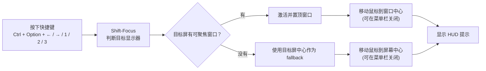

# Shift-Focus

> 用快捷键把键盘焦点、鼠标光标和注意力一起切到目标显示器。

[](https://www.apple.com/macos/)
[](https://www.swift.org/)
[](LICENSE)

Shift-Focus 是一个 macOS 菜单栏小工具，专门解决多屏工作时“键盘焦点还在另一块屏幕”的小摩擦。按下全局快捷键后，它会找到目标显示器上的合适窗口并激活它，可选地把鼠标光标移动到该窗口中心，同时显示一个简短 HUD 提示。

## 为什么用它

- 不用先找鼠标、点窗口，再开始输入。
- 支持左右切屏，也支持直接跳到第 1 / 2 / 3 块显示器。
- 可以让鼠标跟随焦点，窗口、光标和视觉提示保持在同一块屏幕。

## 工作方式



## 功能

- 在左右显示器之间切换当前键盘焦点
- 直接跳转到第 1 / 2 / 3 块显示器
- 目标屏有窗口时，自动激活并置顶合适的窗口
- 可选让鼠标光标跟随焦点移动到目标窗口中心
- 目标屏没有可聚焦窗口时，可将鼠标移动到目标屏中心
- 切换时显示一个简短的 HUD 提示
- 支持菜单栏运行和登录启动

## 快捷键

| 快捷键 | 行为 |
| --- | --- |
| `Ctrl + Option + ←` | 切到左侧显示器 |
| `Ctrl + Option + →` | 切到右侧显示器 |
| `Ctrl + Option + 1` | 跳到第 1 块显示器 |
| `Ctrl + Option + 2` | 跳到第 2 块显示器 |
| `Ctrl + Option + 3` | 跳到第 3 块显示器 |

显示器编号按屏幕从左到右排序。

## 菜单栏选项

点击菜单栏图标可以看到：

- `About Shift-Focus`：查看快捷键说明
- `Launch at Login`：开机登录后自动启动
- `Move Cursor with Focus`：焦点切换时是否移动鼠标光标
- `Quit`：退出应用

`Move Cursor with Focus` 默认开启。关闭后，Shift-Focus 只移动键盘焦点并显示 HUD，不移动鼠标。

## 权限

Shift-Focus 需要 macOS 的“辅助功能”权限，才能读取和激活其他应用窗口。

首次启动时，如果没有权限，应用会提示你打开：

```text
系统设置 → 隐私与安全性 → 辅助功能
```

请把 `Shift-Focus.app` 加入列表并启用。

如果你重新构建后遇到权限列表里还是旧应用的问题，可以执行：

```sh
make reset-accessibility
make install
```

然后重新授予辅助功能权限。

## 构建与安装

要求：

- macOS 13 或更新版本
- Swift 5.9 或更新版本
- Xcode Command Line Tools

构建 release 二进制：

```sh
make build
```

生成 `.app`：

```sh
make app
```

安装到 `/Applications` 并启动：

```sh
make install
```

清理构建产物：

```sh
make clean
```

## 代码签名说明

默认构建使用 ad-hoc 签名，并写入稳定的 designated requirement，避免每次重新构建后 macOS 都把它当作一个全新的辅助功能应用。

如果你有自己的 Apple Development 或 Developer ID 证书，可以这样签名：

```sh
make install SIGN_IDENTITY="Apple Development: Your Name (...)"
```

当前项目没有 notarize。第一次运行时，macOS 可能会根据你的系统安全设置显示额外确认。

## 日志

运行日志写入：

```text
~/Library/Logs/Shift-Focus/shift-focus.log
```

如果快捷键没有反应、权限异常或窗口没有被正确聚焦，可以先查看这个日志。

## 开发

项目使用 Swift Package Manager，主要代码在：

```text
Sources/Shift-Focus/
```

应用图标由脚本生成：

```sh
swift Scripts/generate_app_icon.swift
```

生成结果位于：

```text
Assets/AppIcon.icns
Assets/AppIcon.iconset/
```

## GitHub 元信息

Description：

```text
macOS menu bar utility for moving keyboard focus across displays with global shortcuts.
```

推荐 Topics：

```text
macos, swift, menu-bar, accessibility, multi-monitor, productivity, keyboard-shortcuts
```

## License

MIT License。详见 [LICENSE](LICENSE)。
